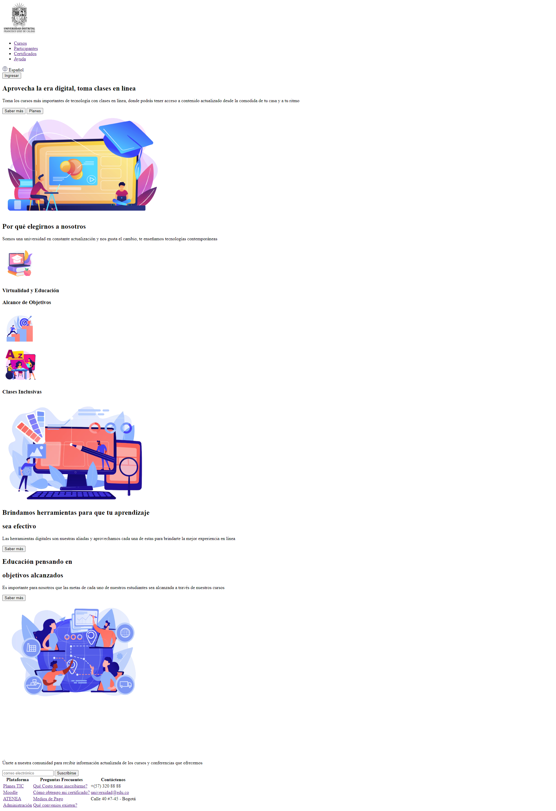

<h1>Taller 9 Jefferson Andrés Conde Torres</h1>

<h2> Información</h2>

Curso: full Stack Basico - Grupo 1

Profesor: Cristian Patiño

<h2> Punto 1: Link figma</h2>

<a href="https://www.figma.com/file/yVHEhvMJ8C0wIbGw7Al6Ea/Jefferson-Andr%C3%A9s-Conde-Torres?type=design&node-id=3%3A102&mode=design&t=5U8d8mQEn3DGxRXS-1" target="_blank">Link de Figma</a>

<h2>Punto 2: HTML</h2>

